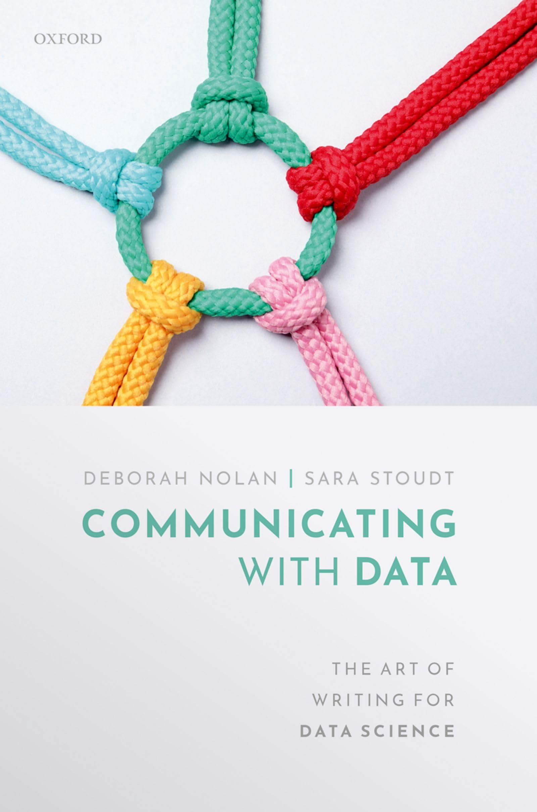

```{r setup, include=FALSE}
knitr::opts_chunk$set(echo = FALSE)

# Learn more about creating websites with Distill at:
# https://rstudio.github.io/distill/website.html

```


```{r, fig.align='center', out.width='60%'}

```


Deborah Nolan is Professor Emerita and Professor of the Graduate School at the University of California, Berkeley. Her research has involved the empirical process, high-dimensional modeling, and, more recently, technology in education and reproducible research. Sara Stoudt is an applied statistician whose work primarily focuses on environmental and ecological applications. She is currently an assistant professor at Bucknell University. She received her PhD in Statistics from UC Berkeley. Prior to that she received a B.A. in Mathematics (with an emphasis on statistics) from Smith College.

[**Link to the book**](https://global.oup.com/academic/product/communicating-with-data-9780198862741)

[Nolan Website](https://www.stat.berkeley.edu/~nolan/)

[Stoudt Website](https://sastoudt.github.io/)
